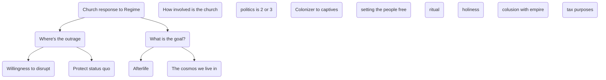

```mermaid
flowchart TD
id1(Church response to Regime) --> id2(Where's the outrage)
id1 --> id3(What is the goal?)
id3 --> id4(Afterlife)
id3 --> id7(The cosmos we live in)
id2 --> id5(Willingness to disrupt)
id2 --> id6(Protect status quo)
id8(How involved is the church)
id9(politics is 2 or 3)
id10(Colonizer to captives)
id11(setting the people free)
id12(ritual)
id13(holiness)
id14(colusion with empire)
id15(tax purposes)
```
